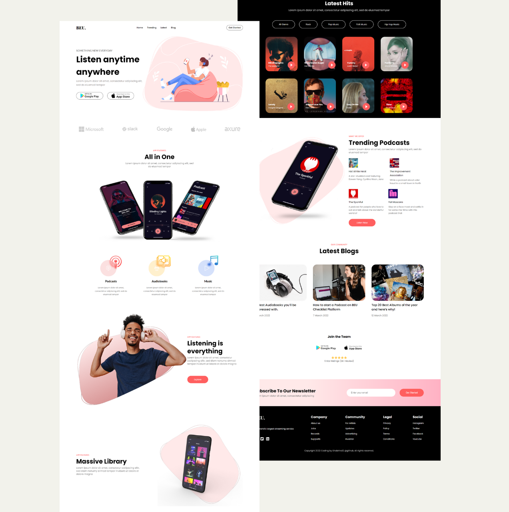

# Responsive Front End Website - BEU Music using React JS
This project is a single page web front end for Learn It using the React JS framework. I created this project as an exercise to develop front end skills

## Table of contents

- [Overview](#overview)
  - [The challenge](#the-challenge)
  - [Screenshot](#screenshot)
  - [Links](#links)
- [My process](#my-process)
  - [Built with](#built-with)
  - [What I learned](#what-i-learned)
  - [Continued development](#continued-development)
  - [Useful resources](#useful-resources)
- [Author](#author)
- [Acknowledgments](#acknowledgments)


## Overview

### The challenge

- Build out the project to the designs provided

### Screenshot


### Links
- [Live Site URL](https://glowing-tarsier-b071f1.netlify.app/)

## My process

### Built with

- Semantic HTML5 markup
- CSS custom properties
- Flexbox
- CSS Grid
- [React JS](https://reactjs.org/) - JS library
- [react icons](https://react-icons.github.io/react-icons/) - JS library to add icons

### What I learned

I learned a simple way to add slider function in testimonial section using react slick library

Code snippets, see below:
```js
const settings = {

    };
```

If you want more help with writing markdown, we'd recommend checking out [The Markdown Guide](https://www.markdownguide.org/) to learn more.


### Continued development
The development of this project can be continued by creating multiple page for each list in navigation bar, and implementing infinite scrolling in the feature courses section

### Useful resources
- [Figma Web Design & elements i used for this project is published by Dmm Kreativ](https://ui8.net/dmm-kreativ/products/uniquepages?status=7)
- [UI/UX Design Resources](https://ui8.net/) - This website provide many UI/UX design some are free. I really liked this website and will use it going forward.


## Author

- Github - [Shabrina Putri](https://github.com/shabrina12/)
- Instagram - [@shabputri_](https://www.twitter.com/yourusername)


## Acknowledgments

This is where you can give a hat tip to anyone who helped you out on this project. Perhaps you worked in a team or got some inspiration from someone else's solution. This is the perfect place to give them some credit.
